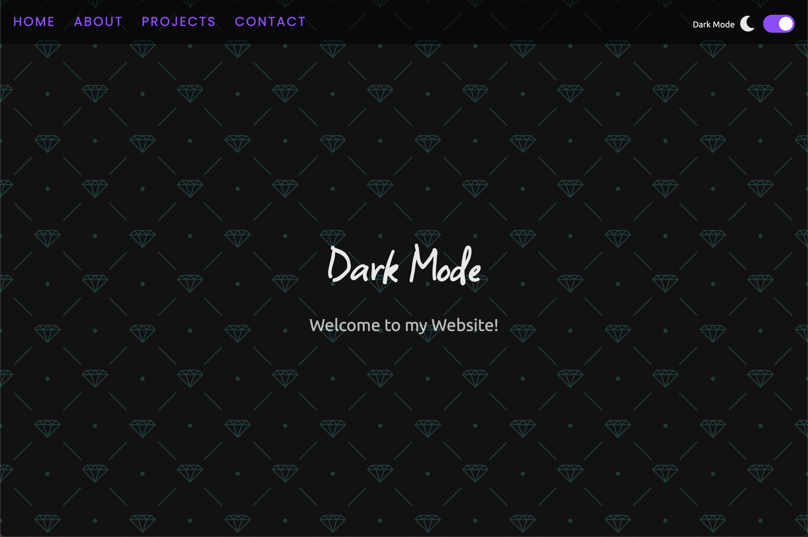
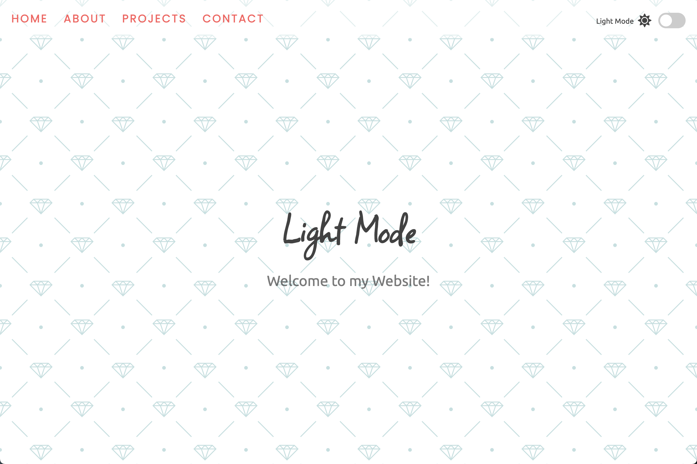

# Light Dark Mode

## URL

https://vasildimov98.github.io/05.light-dark-mode/

## Description

The Light Dark Switcher is a personal project developed using JavaScript, aimed at providing a seamless transition between light and dark modes in a web application or website. This project allows users to dynamically switch the color scheme of the user interface, enhancing the visual experience based on their preference.

The Light Dark Switcher project serves as a practical exercise in JavaScript development and UI/UX design. It empowers developers to enhance their applications by offering a choice between light and dark modes, catering to the diverse preferences of users. With its simplicity and versatility, the Light Dark Switcher is an ideal addition to any personal project or learning endeavor involving JavaScript and web development.

## Dark Mode

## Light Mode

